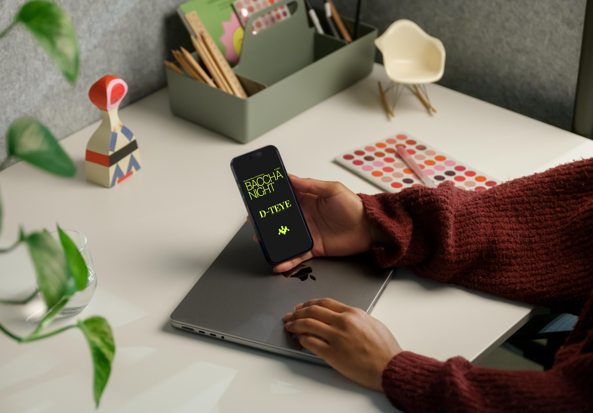
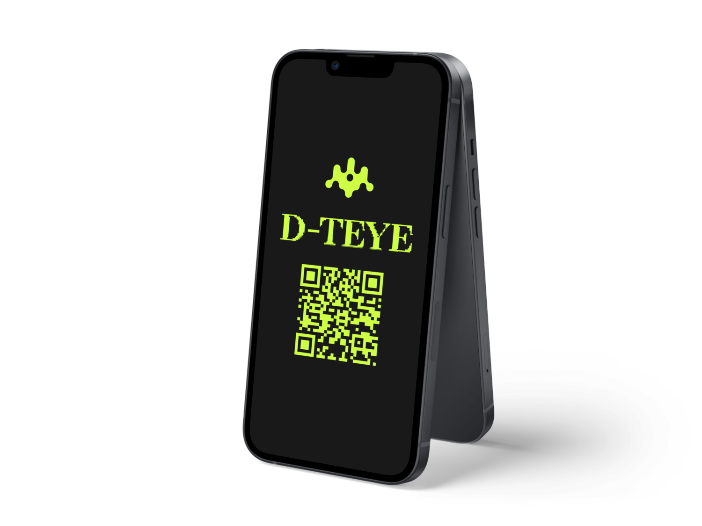

## The context of this project 🧑🏻‍💻

This is a fictional Business Security Audit of a fictional business called Botium Toys as part of my current Google's Cybersecurity Certificate Practical Modules.

As my current career objective is to become a Security Analyst, I'm following this certificate to land an entry-level position in the near future.

## Scope and Goals of the audit? 🤓

With my group called <a href="https://allela-ed132b.webflow.io/" style="text-decoration:underline;color:blue">Allela</a> (also a freelance collective), we developed D-Teye.

What’s that?

It consisted of a web application developed on **Next.js and TailwindCSS**, the story behind was that a malware infected the event and reinterpreted (at its manner) two different paintings from the museum and created **“fake”** stories of them.

The storytelling takes you to find the differences between the original paintings and the malware-infected ones using a short game-type search on the users mobile devices.
,,

## What did I learn? 🧐

In this project I  learned to develop a web application using **Next.js**, knowing that I haven’t coded before with this framework, it was a veritable challenge to learn and develop almost at the same time and finish the project on time for presentation.

The **coordination** with the whole team was crucial to be conscient of the project requirements and the time we had to develop them, in our class we call it MVP, in english is traduced to the **Best Possible Version**.

In addition, I wanted to put my touch on it by putting a Cybersecurity related topic such as malware and their potential to alter things.

The experience was incredible,  I learned a lot and probably will be a **Part II** of this one.

## See the project here, it’s in french so good luck or should I say...

## Bonne chance😜

## Stay tuned for more!
