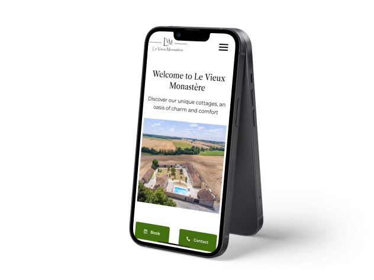

## The context of the project🧑🏻‍💻

This is a project of my actual apprenticeship position as full stack web developer complementing my Bachelor’s Degree on Multimedia and Internet Studies.

## What I’m developing 🤓

Right now, I’m developing a “handmade” booking system for the company, a cottage rental in France that is on its way to modernize itself implementing multiple digital solutions for its customers and for its own business operations, one of them being this project.

✅ Including a full responsive website using Wordpress Elementor and connecting it with Google’s Workspace including (Google Drive, ‘Sheets, Docs, Mail, Forms, AppScript), I’m being able to create a Full Booking System that:

✅ Filters customers booking requests from the websites booking form.

✅ Generates a Sheets Entry for its future curation and the managers analysis of client viability, availabilities, etc.

✅ If the booking is validated, generates the event on Google Calendar for future synchronisation with third-party organizations such as AirBnb and Booking using the iCal API.

✅ And also, creates the contract using the legal team’s Terms & Conditions and a Google Doc Template to then send to the client

## What did I learn so far? 🧐

In this project I’ve been learning many things, professionally and personally speaking.

As on of my first professional projects, the stress is high. My actions can develop some bad consequences for the company, such as wrong information sharing, creation of a bad business reputation when something does not work correctly, etc. So must be attentive, focused and always listening to my managers tips and orders, always ready to learn.

## It's an incredible working experience!

Seeing my work being able to contribute to a real business operations and functioning is something I love.

## <a href ="https://levieuxmonastere.com/en/home/" style="text-decoration:underline;color:#341677">Check the website here 👀 </a>
